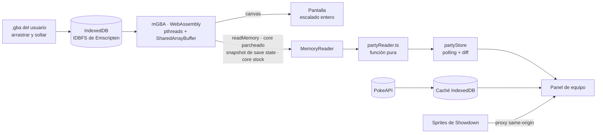

<p align="center">
  
</p>

<p align="center">
  <strong>Pokémon Esmeralda en el navegador, con tu equipo leído en vivo desde la memoria del emulador.</strong><br />
  mGBA compilado a WebAssembly · React 19 · TypeScript · 100 % front-end · tu ROM nunca sale de tu navegador
</p>

---

Emerald Lens corre un emulador de Game Boy Advance en el navegador y, mientras juegas, **lee la RAM de la consola**. Descifra la estructura de datos de Gen 3 y muestra tu equipo Pokémon en un panel lateral que se actualiza solo: PS, nivel, estado, movimientos, IVs, EVs, naturaleza y shiny.

No hay backend. El sitio no incluye ni aloja ninguna ROM. Tú cargas tu propio archivo `.gba`, que se queda en IndexedDB en tu navegador junto con tus partidas.

## Estado actual

| | |
|---|---|
| ✅ Emulación | mGBA en WebAssembly con hilos, escalado entero en píxeles físicos, filtro LCD/CRT opcional, velocidad ×2 como interruptor y sonido on/off |
| ✅ Cartucho | Solo Pokémon Esmeralda (USA/Europa), verificado por código de juego y SHA-1. Lo insertas una vez; se guarda en IndexedDB y arranca solo en cada visita |
| ✅ Lector de equipo | `partyReader.ts` como función pura, verificado contra el decomp oficial [pret/pokeemerald](https://github.com/pret/pokeemerald) y cubierto con tests |
| ✅ Panel de equipo | 6 Pokémon en vivo con sprites animados de Showdown; detalle con radar de stats, IV/EV y movimientos; el sprite estalla en píxeles al debilitarse y lanza destellos al subir de nivel |
| ✅ Controles | Esquema Flechas o WASD dibujado como una GBA que se ilumina al presionar; entrada del juego controlada por el foco (Tab para salir) |
| ✅ Interfaz | Modo noche (esmeralda profundo) y modo día (blanco con esmeralda), pantalla de carga, diseño responsive y monitor de FPS y memoria |
| 🚧 Core parcheado | El parche de lectura de memoria está en `core/`; compilarlo requiere Docker. Mientras tanto se lee la memoria mediante snapshots (ver abajo) |
| 🗺️ Hoja de ruta | Landing, save states con miniatura, gamepad y controles táctiles, PWA offline, trainer card, mapa, timeline y modo streamer |

## Cómo funciona



### 1. Elegir un core que exponga la memoria

Antes de escribir código evalué los cores de GBA para WebAssembly con una condición: poder **leer la memoria del sistema desde JavaScript**. El candidato natural era `@thenick775/mgba-wasm`, el core de gbajs3. Al inspeccionar sus tipos (`mgba.d.ts`) y sus funciones C exportadas, resultó que **no expone lectura de memoria**: no tiene `read8`/`readRange`, y `HEAPU8` es interno.

La solución fue un parche mínimo sobre el fork, en [`core/patches/0001-expose-memory-read.patch`](core/patches/0001-expose-memory-read.patch). Agrega `readMemoryRange()` en C y `readMemory()` en JS. Usa `rawRead8` (la vista de depurador de mGBA, sin efectos secundarios en el bus) e interrumpe el hilo del core mientras copia, así cada lectura es un snapshot consistente. [`core/build.sh`](core/build.sh) aplica el parche sobre un commit fijo y compila con la imagen oficial `emscripten/emsdk` en Docker.

**Respaldo sin compilar.** Si el core vendorizado es el stock, la app toma un save state en un slot oculto y extrae la EWRAM del archivo. mGBA guarda el estado serializado comprimido con zlib dentro de un chunk PNG `gbAs` (`src/core/serialize.c`), y la WRAM está en el offset `0x21000` (`include/mgba/internal/gba/serialize.h`). Se descomprime con `DecompressionStream`, sin librerías. `Emulator.captureMemory()` oculta cuál de los dos caminos se usa, así que el resto de la app no cambia.

### 2. Aislamiento cross-origin

El core usa hilos, así que necesita `SharedArrayBuffer`, y el navegador solo lo habilita con:

```
Cross-Origin-Opener-Policy: same-origin
Cross-Origin-Embedder-Policy: require-corp
```

Esto tiene consecuencias en todo el sitio. Las fuentes se sirven desde el propio sitio (`@fontsource`), y cualquier recurso externo tiene que enviar CORS o CORP. Los sprites de Pokémon Showdown no envían ninguno de los dos (lo verifiqué con `curl`), así que se sirven a través de un proxy same-origin en `/sprites/showdown/*`. Si fallan, se usan los sprites de Esmeralda de PokeAPI en jsDelivr, que sí envía `cross-origin-resource-policy`.

### 3. El formato de datos de Gen 3

Cada Pokémon del equipo ocupa 100 bytes en `gPlayerParty` (`0x020244EC`), y el tamaño del equipo está en `gPlayerPartyCount` (`0x020244E9`). Las direcciones salen de la rama `symbols` de pret/pokeemerald y la estructura, de `include/pokemon.h`:

| Bytes | Campo | Notas |
|---|---|---|
| 0–3 | `personality` | Define la naturaleza (`% 25`), el orden de los subbloques (`% 24`), la letra de Unown y, junto con el OTID, si es shiny |
| 4–7 | `otId` | ID público y ID secreto del entrenador original |
| 8–17 | Apodo | Codificación de texto propia de Gen 3; `0xFF` termina la cadena |
| 19 | Flags | `isBadEgg`, `hasSpecies`, `isEgg` |
| 28–29 | Checksum | Suma de 16 bits de los 48 bytes descifrados |
| 32–79 | Bloque cifrado | 4 subbloques de 12 bytes: Growth, Attacks, EVs, Misc |
| 80–99 | Sin cifrar | Estado, nivel, PS actuales y máximos, y stats calculados |

**Descifrado.** Cada palabra de 32 bits del bloque se combina por XOR con `personality ^ otId`. Luego se reordenan los 4 subbloques según `personality % 24`, usando la tabla `SUBSTRUCT_CASE` de `GetSubstruct`. Si el checksum no coincide, el espacio se descarta. Casi siempre es una lectura hecha a mitad de una escritura, así que el panel conserva la lectura anterior y reintenta.

**Datos derivados.**
- **IVs:** vienen empaquetados en 30 bits del subbloque Misc, junto con los bits de huevo y de habilidad.
- **Shiny:** `(OTID alto ^ OTID bajo ^ PID alto ^ PID bajo) < 8`.
- **Especie:** el índice interno de Gen 3 se convierte a número de la Pokédex nacional. Del 1 al 251 coinciden; a partir del 277, Hoenn tiene su propio orden.
- **Deoxys:** en Esmeralda aparece en su forma Velocidad (`sDeoxysBaseStats`).

**Nada escrito a mano.** [`scripts/gen3/generate.mjs`](scripts/gen3/generate.mjs) genera las tablas de especies, objetos y caracteres a partir del decomp. Además, cruza los slugs de los 386 Pokémon con el `pokedex.json` de Showdown y los IDs de objetos y movimientos con PokeAPI, y reporta cualquier diferencia.

**Datos de la Gen 3.** Los tipos y valores de PokeAPI son los actuales, así que la capa de datos aplica `past_types` y `past_values`. Por eso Clefairy sale como Normal (el tipo Hada no existía) y Rayo con potencia 95.

### 4. Detalles de la interfaz

- **Escalado entero en píxeles físicos.** El tamaño de la pantalla se calcula en píxeles de dispositivo, así que cada píxel de la GBA mide lo mismo también en pantallas HiDPI. Se recalcula con el zoom del navegador y al cambiar de monitor. La función es pura y tiene tests: [`computeScale.ts`](src/ui/game-screen/computeScale.ts).
- **Entrada controlada por el foco.** El core escucha el teclado en `window`, así que la app le pasa las teclas solo cuando la pantalla tiene el foco. Así Enter nunca activa un botón y además presiona Start a la vez, y al salir con Tab o al cambiar de pestaña se sueltan las teclas presionadas.
- **Monitor de rendimiento.** Los FPS de emulación salen de `gMain.vblankCounter1`, el contador que el propio juego incrementa en cada VBlank, leído junto con el equipo; no se engancha al loop del core. La memoria usa `performance.measureUserAgentSpecificMemory()` (solo disponible con aislamiento cross-origin) y, si el navegador no la ofrece, el heap de JavaScript.
- **Velocidad ×2 sin mantener teclas.** El core trae fijo "mantén F para acelerar" y "mantén R para rebobinar". La app intercepta esas teclas en el canvas antes de que lleguen al listener del core: F alterna ×2 y el rebobinado queda desactivado (`rewindEnable: false`, lo que además ahorra su buffer de estados).
- **Panel sin scroll.** Durante el juego, el panel muestra solo los controles y el equipo. El resto de las opciones está detrás de la tuerca. El tamaño de cada sprite se calcula a partir de la altura real de la fila y se reduce solo por divisores enteros, para que se vea nítido.

## Correrlo localmente

```bash
npm install
npm run dev
```

Abre `http://localhost:5173` e inserta tu copia de Pokémon Esmeralda (USA/Europa). Las direcciones de memoria están verificadas para ese dump exacto, así que la app rechaza otros juegos, otras regiones y hacks: comprueba el código `BPEE` del header y el SHA-1 del archivo.

| Comando | Qué hace |
|---|---|
| `npm run dev` | Servidor de desarrollo con los headers COOP/COEP y el proxy de sprites |
| `npm test` | Tests unitarios con Vitest: lector de equipo, sprites y escalado |
| `npm run build` | Type check y build de producción en `dist/` |
| `npm run build:core` | Compila el core parcheado (requiere Docker) |
| `node scripts/gen3/generate.mjs` | Regenera las tablas de Gen 3 desde el decomp |

**Modo desarrollo.** Si existe `dev-roms/emerald.gba` (ignorado por git), la ROM se carga sola al abrir la página. Con `?autoload=0` puedes revisar la pantalla inicial.

## Deploy

[](https://vercel.com/new/clone?repository-url=https%3A%2F%2Fgithub.com%2Fcamilorav31%2Femerald-lens)
[](https://app.netlify.com/start/deploy?repository=https://github.com/camilorav31/emerald-lens)

Es un sitio estático, así que el build no necesita Docker: el core ya viene compilado en `vendor/`.

| Host | Headers COOP/COEP | Proxy de sprites |
|---|---|---|
| Vercel | `vercel.json` | `rewrites` en `vercel.json` |
| Netlify | `public/_headers` | `public/_redirects` |
| Cloudflare Pages | `public/_headers` | ✗ No hace proxy a hosts externos: se usan los sprites de respaldo |
| GitHub Pages | ✗ No permite headers propios. La alternativa es [coi-serviceworker](https://github.com/gzuidhof/coi-serviceworker) (todavía no está integrado) | ✗ |

## Estructura

```
core/            Parche de mGBA + script de build reproducible (Docker)
vendor/mgba-wasm Core compilado (MPL-2.0)
scripts/gen3/    Generador de tablas desde pret/pokeemerald
src/emulator/    Wrapper del core, snapshots de memoria, mapas de teclas
src/memory/      partyReader (puro), formato Gen 3, offsets por versión
src/data/        PokeAPI + caché en IndexedDB
src/sprites/     spriteResolver: nº de Pokédex → slug de Showdown
src/ui/          Consola, panel lateral, equipo, overlays
```

## Créditos

- [mGBA](https://mgba.io) de endrift y el fork para WebAssembly de [thenick775](https://github.com/thenick775/mgba), bajo MPL-2.0. Los archivos modificados están en [`core/patches`](core/patches).
- [pret/pokeemerald](https://github.com/pret/pokeemerald), fuente de la estructura de datos, las direcciones de memoria y las tablas.
- Los sprites animados son de [Pokémon Showdown](https://play.pokemonshowdown.com/sprites/).
- Los datos de especies, movimientos y objetos, y los sprites de respaldo, vienen de [PokeAPI](https://pokeapi.co).

## Aviso legal

Proyecto educativo y de portafolio. **No incluye ni distribuye ninguna ROM**: cada persona carga su propia copia, que nunca sale de su navegador. Usa solo copias de juegos que poseas legalmente.

No está afiliado a Nintendo, Game Freak, Creatures Inc. ni The Pokémon Company. Pokémon y sus nombres son marcas registradas de sus respectivos dueños.
